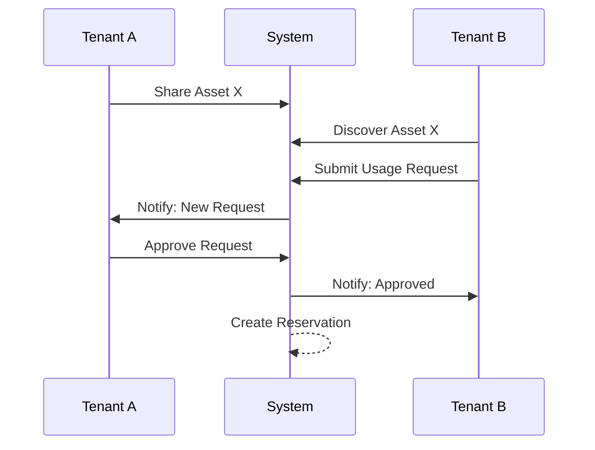

# GİSAŞ Multi-Tenant Asset Platform - Product Requirements

> **Domain**: Shipyard asset management for GİSAŞ  
> **Target Users**: Shipyard workers (gemiciler), dockyard personnel (tersaneciler)  
> **Languages**: Turkish (primary), English

---

## Vision

Multi-tenant platform for shared-purpose assets across GİSAŞ shipyards. Each shipyard is a **Tenant** with data isolation, but assets can be optionally shared across tenants via controlled policies.

---

## Core Principles

| Principle | Description |
|-----------|-------------|
| **Tenant Isolation** | Data scoped to tenant by default |
| **Dynamic Asset Types** | Users/admins create asset categories with custom fields |
| **Dynamic Field Schemas** | Text, numeric, boolean, date, choice fields |
| **Reusable Type Schemas** | Once defined, all tenants use the same schema |
| **Shared Usage** | Controlled asset sharing between tenants |
| **Auditability** | Track all schema and asset changes |
| **Bilingual (TR/EN)** | Full i18n support |

---

## Tenancy Model

### Tenant Structure
- Each shipyard = 1 Tenant (`tenant_id`)
- Users belong to exactly one tenant
- Assets are tenant-owned, private by default

### Roles

| Role | Scope | Permissions |
|------|-------|-------------|
| **Platform Admin** | Global | Manage asset types/schemas, override tenancy |
| **Tenant Admin** | Tenant | Manage users, assets, sharing, approvals |
| **Tenant User** | Tenant | View/create/edit assets per permissions |

---

## Dynamic Asset Types & Schemas

### Asset Type
Represents a category template (e.g., "İskele", "Forklift", "Vinç")

```python
# Fields
name_i18n         # {"tr": "İskele", "en": "Scaffold"}
description_i18n  # {"tr": "...", "en": "..."}
schema_version    # Incremented on changes
is_active         # Boolean
default_shared_policy  # none/discoverable/request-required/auto-available
```

### Field Definition

| Attribute | Description |
|-----------|-------------|
| `label_i18n` | {"tr": "Kullanım Durumu", "en": "Usage Status"} |
| `key` | Stable identifier: `usage_status` |
| `data_type` | text, number, integer, boolean, date, datetime, choice_single, choice_multi |
| `required` | Boolean |
| `validation` | min/max, length, allowed values |
| `choice_options` | `[{key: "good", label_i18n: {tr: "İyi", en: "Good"}}]` |
| `ui_hints` | placeholder, help_text, display_order |

### Base Fields (All Assets)

```
asset_code      # Unique per tenant
title_i18n      # Optional
description     # Text
location        # Text
status          # active/inactive/maintenance
created_at, updated_at, created_by
```

### Schema Versioning
- Schema changes create new version
- Existing assets keep their version
- Soft migration: missing fields = null
- Managed migration: Celery job for conversions

---

## Shared Usage Model

### Visibility Levels

| Level | Description |
|-------|-------------|
| `private` | Default, tenant-only |
| `discoverable` | Limited metadata visible cross-tenant |
| `request_required` | Request → approval workflow |
| `auto_available` | Auto-reservation without approval |

### Sharing Workflow



### Reservation Fields
- start/end date
- purpose
- logistics notes
- status: pending/approved/active/completed/cancelled

---

## Data Model (Django + PostgreSQL)

### Tables

```
tenants
├── id, name, slug, created_at

users (extends AbstractUser)
├── tenant_id (FK)
├── preferred_language (tr/en)

asset_types
├── name_i18n, description_i18n
├── is_active, default_shared_policy

asset_type_schema_versions
├── asset_type_id, version, created_at

asset_type_fields
├── schema_version_id
├── key, label_i18n, data_type
├── choice_options (JSONB)
├── validation_rules (JSONB)
├── display_order

assets
├── tenant_id, asset_type_id, schema_version
├── asset_code, title_i18n, description
├── location, status
├── dynamic_values (JSONB)
├── created_at, updated_at, created_by

asset_shares
├── asset_id, visibility, field_masks

usage_requests
├── requester_tenant_id, asset_id
├── desired_start, desired_end
├── message, status

reservations
├── request_id, actual_start, actual_end
├── status

audit_logs
├── action, table_name, record_id
├── old_data, new_data, user_id, timestamp
```

### Indexes
- `(tenant_id, asset_type_id)` - composite
- `dynamic_values` - GIN index for JSONB queries

---

## API Endpoints

### Asset Types & Schema
| Method | Endpoint | Auth |
|--------|----------|------|
| GET | `/api/asset-types/` | All |
| POST | `/api/asset-types/` | Platform Admin |
| GET | `/api/asset-types/{id}/schema/` | All |
| POST | `/api/asset-types/{id}/schema/` | Platform Admin |

### Assets (Tenant-Scoped)
| Method | Endpoint | Description |
|--------|----------|-------------|
| GET | `/api/assets/` | List tenant assets |
| POST | `/api/assets/` | Create (validated by schema) |
| GET | `/api/assets/{id}/` | Detail |
| PATCH | `/api/assets/{id}/` | Update |

### Sharing & Requests
| Method | Endpoint | Description |
|--------|----------|-------------|
| POST | `/api/assets/{id}/share/` | Share asset |
| GET | `/api/shared-assets/` | Cross-tenant discovery |
| POST | `/api/shared-assets/{id}/request/` | Request usage |
| POST | `/api/requests/{id}/approve/` | Approve |
| POST | `/api/requests/{id}/deny/` | Deny |
| GET | `/api/reservations/` | List reservations |

### Localization
- `Accept-Language: tr|en` header
- Schema endpoints return both TR/EN labels
- Asset endpoints return keys + requested language

---

## Real-Time Notifications (SSE)

### Events
- New usage request
- Approval/denial
- Reservation lifecycle
- Schema updates (optional)

### Channels
- `tenant_notifications_{tenant_id}`
- `user_notifications_{user_id}`

### Payload
```json
{
  "event_type": "usage_request_created",
  "title_i18n": {"tr": "Yeni Talep", "en": "New Request"},
  "message_i18n": {"tr": "...", "en": "..."},
  "metadata": {"request_id": 123, "asset_id": 456}
}
```

---

## Frontend Screens

### Tenant Dashboard
- Overview statistics
- Recent activity
- Quick actions

### My Assets
- List/filter tenant assets
- CRUD operations
- Bulk actions

### Shared Assets
- Cross-tenant discovery
- Filter by type/status/location
- Request workflow

### Requests
- Incoming requests (to approve)
- Outgoing requests (status tracking)
- Timeline view

### Reservations
- Calendar/list view
- Status management

### Asset Type Catalog
- View all types and schemas
- Field definitions with i18n

### Asset Create/Edit
- Schema-driven dynamic form
- Field type → widget mapping
- Validation feedback

---

## i18n Strategy

### Storage
```json
// Stable keys + i18n maps
{
  "name_i18n": {"tr": "İskele", "en": "Scaffold"},
  "label_i18n": {"tr": "Kullanım Durumu", "en": "Usage Status"}
}

// Dynamic values store KEYS only
{
  "usage_status": "good"  // NOT "İyi" or "Good"
}
```

### Rendering
- UI picks label based on `preferred_language`
- Server respects `Accept-Language` header

---

## Non-Functional Requirements

| Requirement | Implementation |
|-------------|----------------|
| **Security** | Tenant scoping in all queries |
| **Audit Trail** | Schema, asset, sharing changes |
| **Performance** | JSONB selective indexing, Redis cache |
| **Scalability** | Celery for heavy jobs |
| **Extensibility** | Add field types without breaking old assets |

---

## Related Documents

- [Project Architecture](./PROJECT_ARCHITECTURE.md)
- [Implementation Tasks](./IMPLEMENTATION_TASKS.md)
