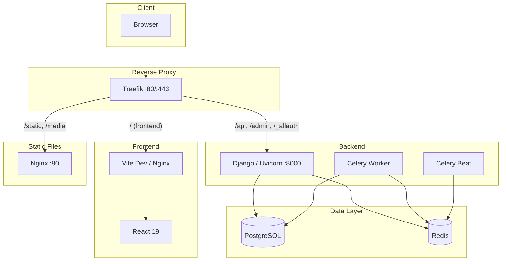

# GisasInventory

Multi-tenant asset management platform for shipyard and dockyard operations.

**Tech Stack:** Django 5 + React 19 + PostgreSQL + Redis + Celery + Traefik

---

## Architecture



---

## Project Structure

```
gisasinventory/
├── .envs/                          # Environment variables (git-ignored)
│   ├── .env.local.example          # Django config template
│   ├── .env.postgres.example       # PostgreSQL credentials template
│   └── .env.traefik.example        # Traefik/domain config template
├── backend/                        # Django Backend
│   ├── apps/                       # Django applications
│   ├── config/                     # Django project config (settings, urls, celery)
│   ├── resources/compose/          # Dockerfiles (local + production)
│   └── pyproject.toml              # Python dependencies (uv)
├── frontend/                       # React Frontend
│   ├── src/                        # Application source
│   ├── compose/                    # Dockerfiles (local + production)
│   └── package.json                # Node dependencies (pnpm)
├── traefik/                        # Reverse Proxy
│   ├── certs/                      # SSL certificates (git-ignored)
│   ├── acme/                       # Let's Encrypt storage (git-ignored)
│   └── compose/                    # Traefik configs (local + production)
├── docker-compose.yml              # Local development orchestration
├── docker-compose.prod.yml         # Production orchestration
├── setup.sh                        # Automated setup script
└── README.md
```

---

## Prerequisites

- **Git**
- **Docker Engine** (v24+)
- **Docker Compose** (v2 plugin)
- **mkcert** (local development only, optional)

---

## Local Development Setup

### 1. Clone the repository

```bash
git clone https://github.com/sametgenc/gisasinventory.git
cd gisasinventory
```

### 2. Run the setup script

```bash
chmod +x setup.sh
./setup.sh --local
```

The script will ask you for:
- **Domain** (default: `localhost`)
- **PostgreSQL database name** (default: `learnwithai`)
- **PostgreSQL user** (default: `learnwithai_user`)
- **PostgreSQL password** (auto-generated if left empty)

It will automatically:
- Generate a Django secret key
- Create all `.envs/` files
- Generate SSL certificates (via mkcert or self-signed)

### 3. Add domain to your hosts file

Replace `yourdomain.com` with the domain you entered in step 2:

```bash
echo "127.0.0.1 yourdomain.com mail.yourdomain.com" | sudo tee -a /etc/hosts
```

### 4. Build and start all services

```bash
docker compose up -d --build
```

### 5. Wait for services to be ready

```bash
docker compose ps
```

All containers should show `running` status. First build may take a few minutes.

### 6. Access the application

| Service | URL |
|---------|-----|
| Frontend | `https://yourdomain.com` |
| API | `https://yourdomain.com/api/` |
| Admin Panel | `https://yourdomain.com/admin/` |
| Mailpit (email testing) | `https://mail.yourdomain.com` |
| Traefik Dashboard | `http://localhost:8080` |

---

## Production Deployment (Linux + Let's Encrypt)

This deploys the `docker-compose.prod.yml` stack on a public Linux server with a real domain and automatic HTTPS from Let's Encrypt (via Traefik).

**Example domain used below:** `platform.gisasgemi.com` — replace with your own.

### 1. DNS prerequisite

Before starting, point your domain's **A record** to the server's public IP:

```
A  platform.gisasgemi.com  ->  YOUR_SERVER_IP
```

Verify propagation:

```bash
dig +short platform.gisasgemi.com
```

### 2. Connect to the server and install prerequisites

```bash
ssh root@YOUR_SERVER_IP
apt update && apt upgrade -y
apt install -y ca-certificates curl gnupg git
```

Install Docker Engine + Compose v2:

```bash
install -m 0755 -d /etc/apt/keyrings
curl -fsSL https://download.docker.com/linux/ubuntu/gpg | gpg --dearmor -o /etc/apt/keyrings/docker.gpg
chmod a+r /etc/apt/keyrings/docker.gpg

echo \
  "deb [arch=$(dpkg --print-architecture) signed-by=/etc/apt/keyrings/docker.gpg] https://download.docker.com/linux/ubuntu \
  $(. /etc/os-release && echo "$VERSION_CODENAME") stable" | \
  tee /etc/apt/sources.list.d/docker.list > /dev/null

apt update
apt install -y docker-ce docker-ce-cli containerd.io docker-buildx-plugin docker-compose-plugin

docker --version
docker compose version
```

### 3. Open firewall ports

```bash
ufw allow 22/tcp
ufw allow 80/tcp
ufw allow 443/tcp
ufw --force enable
```

Ports **80 and 443 must be reachable from the public internet** for Let's Encrypt HTTP-01 challenge.

### 4. Clone the repository

```bash
git clone https://github.com/sametgenc/gisasinventory.git
cd gisasinventory
```

### 5. Run the setup script (production mode)

```bash
chmod +x setup.sh
./setup.sh --prod
```

When prompted:
- **Domain**: `platform.gisasgemi.com`
- **PostgreSQL database name**: press Enter (default)
- **PostgreSQL user**: press Enter (default)
- **PostgreSQL password**: press Enter to auto-generate
- **Let's Encrypt email**: enter a valid email address (required for SSL)

The script will:
- Generate `.envs/.env.local` (DEBUG=False), `.envs/.env.postgres`, `.envs/.env.traefik`
- Generate a random Django secret key
- Create `traefik/acme/acme.json` with correct permissions (600)

### 6. Build and start the production stack

```bash
docker compose -f docker-compose.prod.yml up -d --build
```

First build takes ~5-10 minutes. Traefik will request an SSL certificate from Let's Encrypt on first HTTPS access.

### 7. Watch Traefik obtain the certificate

```bash
docker compose -f docker-compose.prod.yml logs -f traefik
```

You should see a successful ACME challenge for `platform.gisasgemi.com`. The certificate is stored in `./traefik/acme/acme.json`.

### 8. Verify all containers

```bash
docker compose -f docker-compose.prod.yml ps
```

All services should be `running` / `healthy`.

### 9. Create a superuser

```bash
docker compose -f docker-compose.prod.yml exec web python manage.py createsuperuser
```

### 10. Access the application

| Service | URL |
|---------|-----|
| Frontend | `https://platform.gisasgemi.com` |
| API | `https://platform.gisasgemi.com/api/` |
| Admin Panel | `https://platform.gisasgemi.com/admin/` |

### Production useful commands

```bash
# Logs
docker compose -f docker-compose.prod.yml logs -f web
docker compose -f docker-compose.prod.yml logs -f traefik

# Restart a service
docker compose -f docker-compose.prod.yml restart web

# Run migrations manually
docker compose -f docker-compose.prod.yml exec web python manage.py migrate

# Rebuild after code change
docker compose -f docker-compose.prod.yml up -d --build web frontend

# Full teardown (KEEPS volumes/data)
docker compose -f docker-compose.prod.yml down

# Full teardown + DELETE database & media
docker compose -f docker-compose.prod.yml down -v
```

### Clean reinstall from scratch

To wipe everything on the server and reinstall:

```bash
cd gisasinventory
docker compose -f docker-compose.prod.yml down -v
docker system prune -af --volumes
rm -rf .envs/.env.local .envs/.env.postgres .envs/.env.traefik traefik/acme
git pull
./setup.sh --prod
docker compose -f docker-compose.prod.yml up -d --build
```

---

## Useful Commands

### View logs

```bash
# All services
docker compose logs -f

# Specific service
docker compose logs -f web
docker compose logs -f frontend
docker compose logs -f traefik
```

### Restart a service

```bash
docker compose restart web
```

### Django management commands

```bash
# Django shell
docker compose exec web python manage.py shell

# Run migrations manually
docker compose exec web python manage.py migrate

# Create superuser
docker compose exec web python manage.py createsuperuser

# Collect static files
docker compose exec web python manage.py collectstatic --noinput
```

### Stop all services

```bash
docker compose down

# Stop and remove volumes (WARNING: deletes database data)
docker compose down -v
```

### Rebuild a specific service

```bash
docker compose up -d --build web
```

### Rebuild everything from scratch

```bash
docker compose down
docker compose up -d --build
```

---

## Environment Variables

All env files are in the `.envs/` directory. They are created automatically by `setup.sh`.

| Variable | File | Description |
|----------|------|-------------|
| `DATABASE_URL` | `.env.local` | PostgreSQL connection string |
| `DJANGO_SECRET_KEY` | `.env.local` | Django cryptographic key (auto-generated) |
| `DJANGO_DEBUG` | `.env.local` | Debug mode (`True`/`False`) |
| `DOMAIN` | `.env.local`, `.env.traefik` | Application domain |
| `EMAIL_HOST` | `.env.local` | SMTP server host (mailpit for dev) |
| `EMAIL_PORT` | `.env.local` | SMTP port |
| `REDIS_URL` | `.env.local` | Redis connection string |
| `POSTGRES_DB` | `.env.postgres` | Database name |
| `POSTGRES_USER` | `.env.postgres` | Database user |
| `POSTGRES_PASSWORD` | `.env.postgres` | Database password |

---

## Services

| Service | Container | Port | Description |
|---------|-----------|------|-------------|
| traefik | traefik_container | 80, 443, 8080 | Reverse proxy, SSL termination, routing |
| web | django_container | 8000 (internal) | Django API server (Uvicorn) |
| frontend | frontend_container | 5173 (internal) | React dev server (Vite) |
| celeryworker | celery_worker_container | - | Background task processing |
| celerybeat | celery_beat_container | - | Scheduled/periodic tasks |
| postgres | postgres_container | 5432 (internal) | PostgreSQL database |
| redis | redis_container | 6379 (internal) | Cache and message broker |
| nginx | nginx_container | 80 (internal) | Static and media file serving |
| mailpit | mailpit_container | 8025, 1025 (internal) | Email testing (catches all outgoing mail) |
