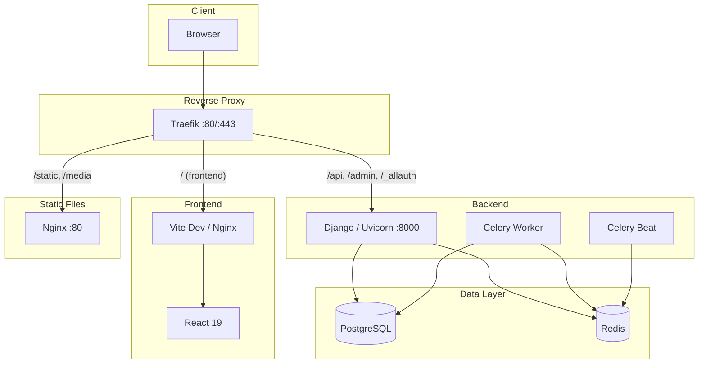

# GisasInventory

Multi-tenant asset management platform for shipyard and dockyard operations.

**Tech Stack:** Django 5 + React 19 + PostgreSQL + Redis + Celery + Traefik

---

## Architecture



---

## Project Structure

```
gisasinventory/
├── .envs/                          # Environment variables (git-ignored)
│   ├── .env.local.example          # Django config template
│   ├── .env.postgres.example       # PostgreSQL credentials template
│   └── .env.traefik.example        # Traefik/domain config template
├── backend/                        # Django Backend
│   ├── apps/                       # Django applications
│   ├── config/                     # Django project config (settings, urls, celery)
│   ├── resources/compose/          # Dockerfiles (local + production)
│   └── pyproject.toml              # Python dependencies (uv)
├── frontend/                       # React Frontend
│   ├── src/                        # Application source
│   ├── compose/                    # Dockerfiles (local + production)
│   └── package.json                # Node dependencies (pnpm)
├── traefik/                        # Reverse Proxy
│   ├── certs/                      # SSL certificates (git-ignored)
│   ├── acme/                       # Let's Encrypt storage (git-ignored)
│   └── compose/                    # Traefik configs (local + production)
├── docker-compose.yml              # Local development orchestration
├── docker-compose.prod.yml         # Production orchestration
├── setup.sh                        # Automated setup script
└── README.md
```

---

## Prerequisites

- **Git**
- **Docker Engine** (v24+)
- **Docker Compose** (v2 plugin)
- **mkcert** (local development only, optional)

---

## Local Development Setup

### 1. Clone the repository

```bash
git clone https://github.com/sametgenc/gisasinventory.git
cd gisasinventory
```

### 2. Run the setup script

```bash
chmod +x setup.sh
./setup.sh --local
```

The script will ask you for:
- **Domain** (default: `localhost`)
- **PostgreSQL database name** (default: `learnwithai`)
- **PostgreSQL user** (default: `learnwithai_user`)
- **PostgreSQL password** (auto-generated if left empty)

It will automatically:
- Generate a Django secret key
- Create all `.envs/` files
- Generate SSL certificates (via mkcert or self-signed)

### 3. Add domain to your hosts file

Replace `yourdomain.co` with the domain you entered in step 2:

```bash
echo "127.0.0.1 yourdomain.co mail.yourdomain.co" | sudo tee -a /etc/hosts
```

### 4. Build and start all services

```bash
docker compose up -d --build
```

### 5. Wait for services to be ready

```bash
docker compose ps
```

All containers should show `running` status. First build may take a few minutes.

### 6. Access the application

| Service | URL |
|---------|-----|
| Frontend | `https://yourdomain.co` |
| API | `https://yourdomain.co/api/` |
| Admin Panel | `https://yourdomain.co/admin/` |
| Mailpit (email testing) | `https://mail.yourdomain.co` |
| Traefik Dashboard | `http://localhost:8080` |

---

## Production Deployment (Linux Server)

### 1. Install Docker on the server

Connect to your server via SSH:

```bash
ssh root@YOUR_SERVER_IP
```

Install Docker Engine:

```bash
apt update && apt upgrade -y

apt install -y ca-certificates curl gnupg

install -m 0755 -d /etc/apt/keyrings
curl -fsSL https://download.docker.com/linux/ubuntu/gpg | gpg --dearmor -o /etc/apt/keyrings/docker.gpg
chmod a+r /etc/apt/keyrings/docker.gpg

echo \
  "deb [arch=$(dpkg --print-architecture) signed-by=/etc/apt/keyrings/docker.gpg] https://download.docker.com/linux/ubuntu \
  $(. /etc/os-release && echo "$VERSION_CODENAME") stable" | \
  tee /etc/apt/sources.list.d/docker.list > /dev/null

apt update
apt install -y docker-ce docker-ce-cli containerd.io docker-buildx-plugin docker-compose-plugin
```

Verify installation:

```bash
docker --version
docker compose version
```

### 2. Clone the repository

```bash
git clone https://github.com/sametgenc/gisasinventory.git
cd gisasinventory
```

### 3. Run the setup script in production mode

```bash
chmod +x setup.sh
./setup.sh --prod
```

The script will ask you for:
- **Domain** (e.g., `gisasassets.co`)
- **PostgreSQL credentials**
- **Let's Encrypt email** (required for automatic SSL)

It will automatically:
- Generate all env files with production settings (`DEBUG=False`)
- Create `traefik/acme/acme.json` with correct permissions (`chmod 600`)

### 4. Open firewall ports

```bash
ufw allow 80/tcp
ufw allow 443/tcp
ufw allow 22/tcp
ufw enable
```

### 5. Set up DNS records

Go to your domain registrar's DNS management panel and add these records:

| Type | Name | Value |
|------|------|-------|
| A | `@` (or `gisasassets.co`) | `YOUR_SERVER_IP` |
| A | `api` | `YOUR_SERVER_IP` |

Wait for DNS propagation (usually 5-30 minutes). Verify with:

```bash
dig +short yourdomain.co
dig +short api.yourdomain.co
```

Both should return your server's IP address.

### 6. Build and start all services

```bash
docker compose -f docker-compose.prod.yml up -d --build
```

First build takes 5-10 minutes.

### 7. Verify everything is running

Check container status:

```bash
docker compose -f docker-compose.prod.yml ps
```

All services should show `running`. Check Traefik logs to confirm SSL certificate was obtained:

```bash
docker compose -f docker-compose.prod.yml logs traefik
```

Look for a line like: `Certificate obtained successfully`.

### 8. Access the application

| Service | URL |
|---------|-----|
| Frontend | `https://yourdomain.co` |
| API | `https://api.yourdomain.co` |

SSL certificates are automatically managed by Traefik via Let's Encrypt. They will auto-renew before expiry.

---

## Useful Commands

### View logs

```bash
# All services
docker compose logs -f

# Specific service
docker compose logs -f web
docker compose logs -f frontend
docker compose logs -f traefik
```

### Restart a service

```bash
docker compose restart web
```

### Django management commands

```bash
# Django shell
docker compose exec web python manage.py shell

# Run migrations manually
docker compose exec web python manage.py migrate

# Create superuser
docker compose exec web python manage.py createsuperuser

# Collect static files
docker compose exec web python manage.py collectstatic --noinput
```

### Stop all services

```bash
docker compose down

# Stop and remove volumes (WARNING: deletes database data)
docker compose down -v
```

### Rebuild a specific service

```bash
docker compose up -d --build web
```

### Production variants

Add `-f docker-compose.prod.yml` to any command above:

```bash
docker compose -f docker-compose.prod.yml logs -f web
docker compose -f docker-compose.prod.yml exec web python manage.py createsuperuser
```

---

## Environment Variables

| Variable | File | Description |
|----------|------|-------------|
| `DATABASE_URL` | `.env.local` | PostgreSQL connection string |
| `DJANGO_SECRET_KEY` | `.env.local` | Django cryptographic key |
| `DJANGO_DEBUG` | `.env.local` | Debug mode (`True`/`False`) |
| `DOMAIN` | `.env.local`, `.env.traefik` | Application domain |
| `EMAIL_HOST` | `.env.local` | SMTP server host |
| `REDIS_URL` | `.env.local` | Redis connection string |
| `POSTGRES_DB` | `.env.postgres` | Database name |
| `POSTGRES_USER` | `.env.postgres` | Database user |
| `POSTGRES_PASSWORD` | `.env.postgres` | Database password |
| `LETS_ENCRYPT_EMAIL` | `.env.traefik` | Email for SSL certificates (production) |

---

## Services

| Service | Container | Port | Description |
|---------|-----------|------|-------------|
| traefik | traefik_container | 80, 443, 8080 | Reverse proxy + SSL |
| web | django_container | 8000 (internal) | Django API server |
| frontend | frontend_container | 5173 / 80 (internal) | React app (Vite dev / Nginx prod) |
| celeryworker | celery_worker_container | - | Background task processing |
| celerybeat | celery_beat_container | - | Scheduled tasks |
| postgres | postgres_container | 5432 (internal) | PostgreSQL database |
| redis | redis_container | 6379 (internal) | Cache and message broker |
| nginx | nginx_container | 80 (internal) | Static/media file serving |
| mailpit | mailpit_container | 8025, 1025 (internal) | Email testing (dev only) |
