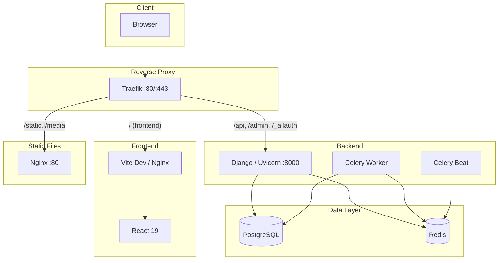

# GisasInventory

Multi-tenant asset management platform for shipyard and dockyard operations.

**Tech Stack:** Django 5 + React 19 + PostgreSQL + Redis + Celery + Traefik

---

## Architecture



---

## Project Structure

```
gisasinventory/
├── .envs/                          # Environment variables (git-ignored)
│   ├── .env.local.example          # Django config template
│   ├── .env.postgres.example       # PostgreSQL credentials template
│   └── .env.traefik.example        # Traefik/domain config template
├── backend/                        # Django Backend
│   ├── apps/                       # Django applications
│   ├── config/                     # Django project config (settings, urls, celery)
│   ├── resources/compose/          # Dockerfiles (local + production)
│   └── pyproject.toml              # Python dependencies (uv)
├── frontend/                       # React Frontend
│   ├── src/                        # Application source
│   ├── compose/                    # Dockerfiles (local + production)
│   └── package.json                # Node dependencies (pnpm)
├── traefik/                        # Reverse Proxy
│   ├── certs/                      # SSL certificates (git-ignored)
│   ├── acme/                       # Let's Encrypt storage (git-ignored)
│   └── compose/                    # Traefik configs (local + production)
├── docker-compose.yml              # Local development orchestration
├── docker-compose.prod.yml         # Production orchestration
├── setup.sh                        # Automated setup script
└── README.md
```

---

## Prerequisites

- **Git**
- **Docker Engine** (v24+)
- **Docker Compose** (v2 plugin)
- **mkcert** (local development only, optional)

---

## Local Development Setup

### 1. Clone the repository

```bash
git clone https://github.com/sametgenc/gisasinventory.git
cd gisasinventory
```

### 2. Run the setup script

```bash
chmod +x setup.sh
./setup.sh --local
```

The script will ask you for:
- **Domain** (default: `localhost`)
- **PostgreSQL database name** (default: `learnwithai`)
- **PostgreSQL user** (default: `learnwithai_user`)
- **PostgreSQL password** (auto-generated if left empty)

It will automatically:
- Generate a Django secret key
- Create all `.envs/` files
- Generate SSL certificates (via mkcert or self-signed)

### 3. Add domain to your hosts file

Replace `yourdomain.com` with the domain you entered in step 2:

```bash
echo "127.0.0.1 yourdomain.com mail.yourdomain.com" | sudo tee -a /etc/hosts
```

### 4. Build and start all services

```bash
docker compose up -d --build
```

### 5. Wait for services to be ready

```bash
docker compose ps
```

All containers should show `running` status. First build may take a few minutes.

### 6. Access the application

| Service | URL |
|---------|-----|
| Frontend | `https://yourdomain.com` |
| API | `https://yourdomain.com/api/` |
| Admin Panel | `https://yourdomain.com/admin/` |
| Mailpit (email testing) | `https://mail.yourdomain.com` |
| Traefik Dashboard | `http://localhost:8080` |

---

## Server Deployment (Linux)

This deploys the same `docker-compose.yml` stack on a remote Linux server. SSL is handled via self-signed certificates generated by the setup script. No domain or DNS configuration required -- you access the app by the server's IP address or any custom domain you point to it via `/etc/hosts`.

### 1. Connect to your server

```bash
ssh root@YOUR_SERVER_IP
```

### 2. Install Docker Engine

```bash
apt update && apt upgrade -y
```

```bash
apt install -y ca-certificates curl gnupg
```

```bash
install -m 0755 -d /etc/apt/keyrings
curl -fsSL https://download.docker.com/linux/ubuntu/gpg | gpg --dearmor -o /etc/apt/keyrings/docker.gpg
chmod a+r /etc/apt/keyrings/docker.gpg
```

```bash
echo \
  "deb [arch=$(dpkg --print-architecture) signed-by=/etc/apt/keyrings/docker.gpg] https://download.docker.com/linux/ubuntu \
  $(. /etc/os-release && echo "$VERSION_CODENAME") stable" | \
  tee /etc/apt/sources.list.d/docker.list > /dev/null
```

```bash
apt update
apt install -y docker-ce docker-ce-cli containerd.io docker-buildx-plugin docker-compose-plugin
```

Verify:

```bash
docker --version
docker compose version
```

### 3. Install Git (if not present)

```bash
apt install -y git
```

### 4. Clone the repository

```bash
git clone https://github.com/sametgenc/gisasinventory.git
cd gisasinventory
```

### 5. Run the setup script

```bash
chmod +x setup.sh
./setup.sh --local
```

When prompted:
- **Domain**: Enter your domain (e.g. `yourdomain.com`) or leave as `localhost`
- **PostgreSQL database name**: Press Enter for default (`learnwithai`)
- **PostgreSQL user**: Press Enter for default (`learnwithai_user`)
- **PostgreSQL password**: Press Enter to auto-generate a secure password

The script will:
- Generate a random Django secret key
- Create `.envs/.env.local`, `.envs/.env.postgres`, `.envs/.env.traefik`
- Generate self-signed SSL certificates with `openssl` (mkcert is not needed on the server)

### 6. Add domain to /etc/hosts on the server

If you entered a custom domain (not `localhost`):

```bash
echo "127.0.0.1 yourdomain.com mail.yourdomain.com" | sudo tee -a /etc/hosts
```

Replace `yourdomain.com` with the domain you entered in step 5.

### 7. Open firewall ports

```bash
ufw allow 22/tcp
ufw allow 80/tcp
ufw allow 443/tcp
ufw enable
```

### 8. Build and start all services

```bash
docker compose up -d --build
```

First build takes approximately 5-10 minutes depending on server resources.

### 9. Verify all containers are running

```bash
docker compose ps
```

Expected output -- all services should show `running`:

```
NAME                    STATUS
traefik_container       running
django_container        running
frontend_container      running
postgres_container      running
redis_container         running
celery_worker_container running
celery_beat_container   running
nginx_container         running
mailpit_container       running
```

### 10. Access the application

From your **local machine**, add the server IP to your hosts file so the domain resolves:

```bash
echo "YOUR_SERVER_IP yourdomain.com mail.yourdomain.com" | sudo tee -a /etc/hosts
```

Then open in your browser:

| Service | URL |
|---------|-----|
| Frontend | `https://yourdomain.com` |
| API | `https://yourdomain.com/api/` |
| Admin Panel | `https://yourdomain.com/admin/` |
| Mailpit | `https://mail.yourdomain.com` |

Your browser will warn about the self-signed certificate -- click "Advanced" and "Proceed" to accept it.

### 11. Create a superuser (first time only)

```bash
docker compose exec web python manage.py createsuperuser
```

---

## Useful Commands

### View logs

```bash
# All services
docker compose logs -f

# Specific service
docker compose logs -f web
docker compose logs -f frontend
docker compose logs -f traefik
```

### Restart a service

```bash
docker compose restart web
```

### Django management commands

```bash
# Django shell
docker compose exec web python manage.py shell

# Run migrations manually
docker compose exec web python manage.py migrate

# Create superuser
docker compose exec web python manage.py createsuperuser

# Collect static files
docker compose exec web python manage.py collectstatic --noinput
```

### Stop all services

```bash
docker compose down

# Stop and remove volumes (WARNING: deletes database data)
docker compose down -v
```

### Rebuild a specific service

```bash
docker compose up -d --build web
```

### Rebuild everything from scratch

```bash
docker compose down
docker compose up -d --build
```

---

## Environment Variables

All env files are in the `.envs/` directory. They are created automatically by `setup.sh`.

| Variable | File | Description |
|----------|------|-------------|
| `DATABASE_URL` | `.env.local` | PostgreSQL connection string |
| `DJANGO_SECRET_KEY` | `.env.local` | Django cryptographic key (auto-generated) |
| `DJANGO_DEBUG` | `.env.local` | Debug mode (`True`/`False`) |
| `DOMAIN` | `.env.local`, `.env.traefik` | Application domain |
| `EMAIL_HOST` | `.env.local` | SMTP server host (mailpit for dev) |
| `EMAIL_PORT` | `.env.local` | SMTP port |
| `REDIS_URL` | `.env.local` | Redis connection string |
| `POSTGRES_DB` | `.env.postgres` | Database name |
| `POSTGRES_USER` | `.env.postgres` | Database user |
| `POSTGRES_PASSWORD` | `.env.postgres` | Database password |

---

## Services

| Service | Container | Port | Description |
|---------|-----------|------|-------------|
| traefik | traefik_container | 80, 443, 8080 | Reverse proxy, SSL termination, routing |
| web | django_container | 8000 (internal) | Django API server (Uvicorn) |
| frontend | frontend_container | 5173 (internal) | React dev server (Vite) |
| celeryworker | celery_worker_container | - | Background task processing |
| celerybeat | celery_beat_container | - | Scheduled/periodic tasks |
| postgres | postgres_container | 5432 (internal) | PostgreSQL database |
| redis | redis_container | 6379 (internal) | Cache and message broker |
| nginx | nginx_container | 80 (internal) | Static and media file serving |
| mailpit | mailpit_container | 8025, 1025 (internal) | Email testing (catches all outgoing mail) |
